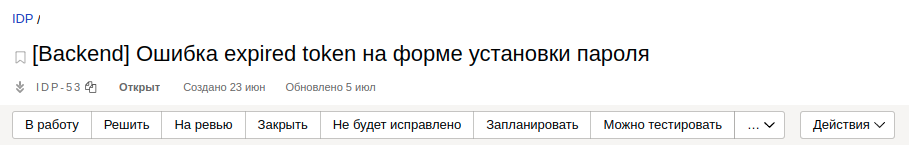
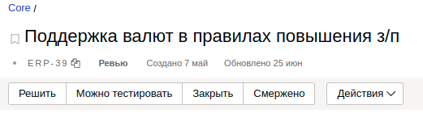
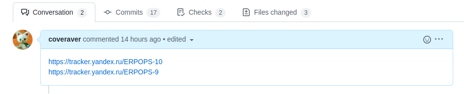
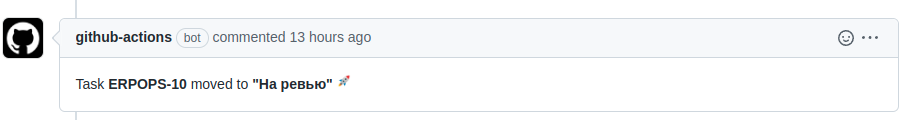
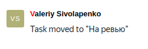

# Github action - изменение состояния задачи на доске Яндекс Трекера

[ENG](https://github.com/evrone-erp/yandex-tracker-action/blob/master/README.md)

[Использовать экшен](https://github.com/marketplace/actions/move-yandex-tracker-task-on-board)

## Мотивация

Яндекс Трекер не имеет (на текущий момент) автоматизации по изменению состояния задачи, над которой работает
разработчик.

Экшен позволят автоматически передвигать задачу на доске в момент работы над ней.

Экшен может передвигать задачу в два состояния:

- Открытый Pull Request - “На ревью”
- Смерженный Pull Request - “Смержено”

У каждой задачи есть свой бизнес-процесс или состояние, в котором она может находиться



Когда разработчик открывает Pull Request, задача автоматически перемещается в состояние “На ревью”, даже, если
разработчик не взял ее в работу



После успешного прохождения ревью задача перемещается в состояние “Смержено”

## Работа с экшеном

Создайте в репозитории файл `.github/workspace/task-transition.yaml` следующего содержания (далее разберем подробно со
всеми обязательными и опциональными параметрами):

```yaml
name: YC Tracker
on:
  pull_request:
    types:
      - opened
      - reopened
      - synchronize
      - closed

jobs:
  validate-rules-and-move-task:
    runs-on: ubuntu-latest
    steps:
      - name: Checkout
        uses: actions/checkout@v3
        with:
          ref: ${{ github.event.pull_request.head.sha }}

      # Выполняется, когда PR октрыт
      - name: Move Task When PR Opened
        if: github.event.action != 'closed'
        uses: SelSup/ya-tracker-action@v1.0.4
        with:
          token: ${{secrets.GITHUB_TOKEN}}
          yandex_org_id: ${{ secrets.YANDEX_ORG_ID }}
          yandex_oauth2_token: ${{ secrets.YANDEX_OAUTH2_TOKEN }}

      # Выполняется, когда PR смержен
      - name: Move Task When PR Merged
        if: github.event.pull_request.merged == true
        uses: SelSup/ya-tracker-action@v1.0.4
        with:
          token: ${{secrets.GITHUB_TOKEN}}
          yandex_org_id: ${{ secrets.YANDEX_ORG_ID }}
          yandex_oauth2_token: ${{ secrets.YANDEX_OAUTH2_TOKEN }}
```

Выше мы видим, что экшен вызывается два раза

- когда PR открыт
- когда PR смержен

## Что происходит, когда вы открываете PR

В ранее созданном файле `task-transition.yaml` можно указать номер задачи или несколько задач, разделенных запятыми,
которые необходимо двигать на доске

```yaml
- name: Move Task When PR Opened
  if: github.event.action != 'closed'
  uses: SelSup/ya-tracker-action@v1.0.4
  with:
    token: ${{secrets.GITHUB_TOKEN}}
    yandex_org_id: ${{ secrets.YANDEX_ORG_ID }}
    yandex_oauth2_token: ${{ secrets.YANDEX_OAUTH2_TOKEN }}
    tasks: ERP-11,ERP-12 # можно указать номера задач
```

Помимо этого в процессе работы на PR, если был сделан коммит с номером задачи, отличным от указанного в `tasks`, он так
же будет обработан.

**Важно** Задачи из коммитов забираются из `[]`. Например, `"[DI-118] fix something"`. Если подытожить наши знания, то
задачи для обработки будут: `ERP-11,ERP-12,DI-118`.

Если вы используете другой подход в коммитах и не указаываете номера задач в `[]`, то такие коммиты будут
игнорироваться. В этом случае, вы можете добавить новую задачу в `tasks` файла `task-transition.yaml`.

Собранные задачи будут переведены в статус `"На ревью"` и в PR, а так же в сами задачи, будут добавлены соответсвующие
комментарии (ниже примеры).

В описание PR будут добавлены ссылки на задачи в трекере:



Если вы не хотите обновлять описание в PR удалите или переключите инпут `task_url` в `false` в
файле `task-transition.yaml`

```yaml
- name: Move Task When PR Opened
  if: github.event.action != 'closed'
  uses: SelSup/ya-tracker-action@v1.0.4
  with:
    token: ${{secrets.GITHUB_TOKEN}}
    yandex_org_id: ${{ secrets.YANDEX_ORG_ID }}
    yandex_oauth2_token: ${{ secrets.YANDEX_OAUTH2_TOKEN }}
    task_url: false # или удалите этот инпут. Значение по-умолчанию false
```

## Игнорирование задач

Часто бывают задачи с долгим жизненным циклом. Например, ежедневные созвоны или сопровождение проектов. В этом случае мы
можем хотеть игнорировать эти задачи, чтобы они не двигались на доске. Укажите номера задач в
файле `task-transition.yaml` в инпуте `ignore`:

```yaml
- name: Move Task When PR Opened
  if: github.event.action != 'closed'
  uses: SelSup/ya-tracker-action@v1.0.4
  with:
    token: ${{secrets.GITHUB_TOKEN}}
    yandex_org_id: ${{ secrets.YANDEX_ORG_ID }}
    yandex_oauth2_token: ${{ secrets.YANDEX_OAUTH2_TOKEN }}
    ignore: ERPOPS-7,EPR-21 # какие задачи игнорировать
```

## Указать состояние задачи

По-умолчанию, при открытом PR задачи перемещаются в состояние `"На ревью"`. При смерженом - `"Решено"`.

Если необходимо перемещать задачу в отличное состояние, то можно указать это состояние в файле `task-transition.yaml` в
инпуте `to`:

```yaml
- name: Move Task When PR Opened
  if: github.event.action != 'closed'
  uses: SelSup/ya-tracker-action@v1.0.4
  with:
    token: ${{secrets.GITHUB_TOKEN}}
    yandex_org_id: ${{ secrets.YANDEX_ORG_ID }}
    yandex_oauth2_token: ${{ secrets.YANDEX_OAUTH2_TOKEN }}
    to: testing # или Тестирование - важно! Имя должно существовать в бизнес-процессе переходов задачи
```

### Добавление комментария к задаче Yandex Tracker

Пример GitHub action, который собирает новую версию, публикует ее в Yandex Docker Registry и добавления комментария в Yandex Tracker

Укажите параметр comment с текстом комментария

```yaml
- name: Create a GitHub release
  uses: actions/create-release@v1
  env:
    GITHUB_TOKEN: ${{ secrets.GITHUB_TOKEN }}
  with:
    tag_name: ${{ steps.tag_version.outputs.new_tag }}
    release_name: Release ${{ steps.tag_version.outputs.new_tag }}
    body: ${{ steps.tag_version.outputs.changelog }}
- name: Set up Docker Buildx
  uses: docker/setup-buildx-action@v3
- name: Login to Yandex Cloud Container Registry
  id: login-cr
  uses: yc-actions/yc-cr-login@v2
  with:
    yc-sa-json-credentials: ${{ secrets.YC_SA_JSON_CREDENTIALS }}
- name: Build, tag, and push image to Yandex Cloud Container Registry
  env:
    CR_REGISTRY: {docker_registry}
    CR_REPO: yc-cr-github-action
    IMAGE_TAG: ${{ steps.tag_version.outputs.new_tag }}
  run: |
    docker build -t cr.yandex/{docker_registry}/{component}:${{ steps.tag_version.outputs.new_tag }} .
    docker push cr.yandex/{docker_registry}/{component}:${{ steps.tag_version.outputs.new_tag }}
- name: Add comment to Yandex Tracker
  uses: SelSup/ya-tracker-action@v1.0.4
  with:
    token: ${{secrets.GITHUB_TOKEN}}
    yandex_org_id: ${{ secrets.YANDEX_ORG_ID }}
    yandex_oauth2_token: ${{ secrets.YANDEX_OAUTH2_TOKEN }}
    comment: New version is ${{ steps.tag_version.outputs.new_tag }}
```

## Если задача не существует

В этом случае она будет проигнорирована и вы сможете увидеть в выводе работы экшена сообщение об этом

`WARNING! TASK E-9000 NOT FOUND`

## Если задача уже на ревью или состояние для задачи не найдено

Сообщение:

`ERPOPS-10 NOTHING TO DO. AVAILABLE TRANSITIONS IS: {'resolve': 'Решить', 'ready_for_test': 'Можно тестировать', 'need_info': 'Нужна информация', 'close': 'Закрыть'}`

## Если задача обновлена

В выводе экшена можно увидеть сообщение:

`ERPOPS-9 TASK UPDATED `

Так же в самом теле PR будет сообщение:



Сообщение в задаче:



## Мерж PR

Для смерженого PR действуют те же правила, что и для открытого. По-умолчанию, смерженный PR передвигается в `"resolve"`.
Если необходимо перемещать задачу в другое состояние, укажите инпут `to` в файле `task-transition.yaml`:

```yaml
- name: Move Task When PR Merged
  if: github.event.pull_request.merged == true
  uses: SelSup/ya-tracker-action@v1.0.4
  with:
    token: ${{secrets.GITHUB_TOKEN}}
    yandex_org_id: ${{ secrets.YANDEX_ORG_ID }}
    yandex_oauth2_token: ${{ secrets.YANDEX_OAUTH2_TOKEN }}
    to: merged
```

## Доступные инпуты

[action.yaml](https://raw.githubusercontent.com/evrone-erp/yandex-tracker-action/master/action.yaml)

## Обязательные параметры

- `token`: **Обязательно** Токен Github.
- `yandex_oauth2_token`: **Обязательно** Токен Yandex oauth2. Вам необходимо зарегистрировать приложение OAUTH2, а затем
  получить токен пользователя. [Документация](https://yandex.ru/dev/id/doc/dg/oauth/concepts/about.html).
- `yandex_org_id`: **Обязательно** Идентификатор организации, зарегистрированной в [Yandex Tracker](https://tracker.yandex.ru/settings).
- `comment`: **Опционально** Комментарий, который будет добавлен к задаче, например с номеров версии собранной
- `ignore`: **Опционально** Игнорируемые задачи, разделенные запятыми.
- `tasks`: **Опционально** Ключ задачи, которую нужно переместить на доску.
- `task_url`: **Опционально** Значение по умолчанию - `false`. Установите в `true`, если вы хотите прокомментировать PR
  с URL задачи.
- `to`: **Опционально** Укажите, куда вы хотите переместить задачу. По умолчанию - `in_review` **для открытых PR
  и `resolve` для закрытых PR**.

[Документация по получению OAUTH2 токена от Яндекс](https://yandex.ru/dev/id/doc/dg/oauth/concepts/about.html)

[yandex-tracker-action](https://evrone.com/yandex-tracker-action?utm_source=github&utm_medium=yandex-tracker-action)
проект создан и поддержан [Evrone](https://evrone.com/?utm_source=github&utm_medium=yandex-tracker-action)

[](https://evrone.com/?utm_source=evrone-django-template)
